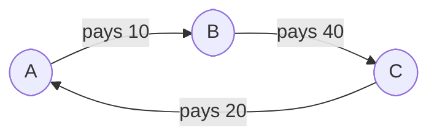
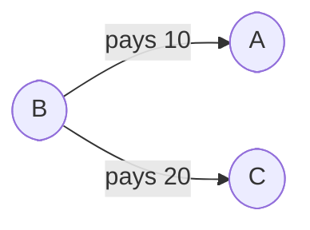

# gBill

*an app for splitting bills amongst other people*

---

## Project Description

This is an app designed to split bills amongst other people by using the **minimal** number of transactions. 

Brief Explanation

When we have multiple people who paid for multiple different transactions, it gets difficult to calculate who owes how much to whom. Simple way to calculate is to sum up everything person A owes to person B. But this creates multiple extraneous transaction. For example, after summing up the debt we have:

**Method 1**
* **`A`** pays **10** to **`B`**
* **`B`** pays **40** to **`C`**
* **`C`** pays **20** to **`A`** 

This required 3 transactions to settle the debts. Now instead, we can have `B` pays for `A` by not accepting the payment from `A`:

**Method 2**
* **`B`** pays **10** to **`A`**
* **`B`** pays **20** to **`C`**

This new method required 2 transactions to settle the debts. And to double check, we can check how much money each person have in the end for each method:

| **Method 1**                      | **Method 2**                        |
|-----------------------------------|-------------------------------------|
| **`A`** has (-10) + (20) = **10** | **`A`** has **10**                  |
| **`B`** has 10 + (-40) = **-30**  | **`B`** has (-10) + (-20) = **-30** |
| **`C`** has 40 + (-20) = **20**   | **`C`** has **20**                  |

And thus, we conclude there is no discrepancy for method 2 despite at a glance it looks wrong.

---

## Note

---

## Future Updates
- [ ] CLI Feature
- [ ] Export result as PDF, PNG, and TXT
